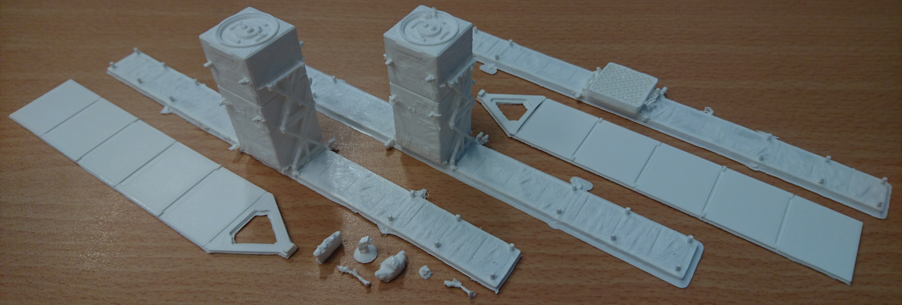

STL files for printing the model. Make sure to move the SAR antenna
from sentinel1print0_body.stl a few tenths of mm in the printing plate
since the bottom of this part is not flat. The solar panel
sentinel1print1_panelx2.stl must be printed twice, with the attachement
to the main body replaced from a fine piece to a cube more solid for
gluing. Attributions of the various parts in the name is tentative and might
be incorrect.

"
