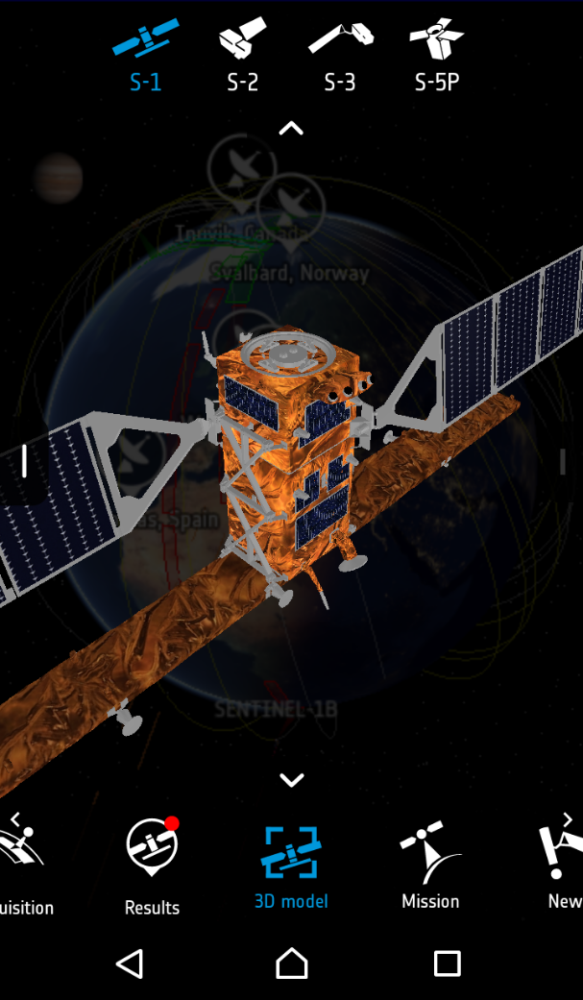
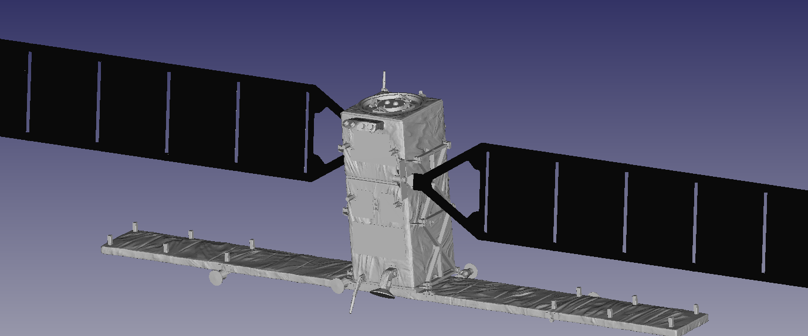

# g3db2stl
Read G3DB (Binary JSON 3D Model) and save STL output: software aimed at interpreting
.g3db files and output STL of each part of the 3D model as a result.

# Compiling

``make`` should generate the executable on any GNU/Linux-Unix system. Command line
only interface allowing for the .g3db filename as input argument.

# Usage

The objective is to generate a 3D-printable model of the Sentinel1 satellite (STL format).
1. Download the APK for example from https://downloadapk.net/down_ESA-Sentinel.html
(no need to worry for Trojan, we only uncompress to get the 3D models of the satellite, will 
not execute on an Android system)
2. ``unzip`` whatever file you downloaded: the output must include ``./assets/model/sentinel1``
which includes multiple g3db files, used as inputs to generate the 3D model we will be interested
in
3. run the provided program against each g3db file to convert to STL, but remember the geometrical
transforms (rotation, scaling, translation) which are handled next in FreeCAD as
```
string: rotation 
array:  float4: -0.707107 -0.000000 0.000000 0.707107 
string: scale 
array:  float3: 6.226656 6.226656 6.226656 
string: translation 
array:  float3: -0.191849 -109.674469 -3.880795 
```
These parameters are used to script FreeCAD when assembling parts.

4. load each STL file in FreeCAD and apply transforms as Python scripts executed in the FreeCAD
Python console, e.g.
```
tr=FreeCAD.Vector(-0.191849,-109.674469,-3.880795)
# https://forum.freecadweb.org/viewtopic.php?t=16949
cm1=FreeCAD.ActiveDocument.getObject("shape1_part1_ai")
q1=(-0.707107,-0.000000,0.000000,0.707107)
# r=FreeCAD.Rotation(*q1)
# r.Axis
# r.Angle
cm1.Placement=FreeCAD.Placement(cm1.Placement.Base,FreeCAD.Rotation(*q1))
cm1.Placement.Base=tr
mat1=FreeCAD.Matrix()
mat1.scale(6.226656,6.226656,6.226656 )
mesh1=cm1.Mesh.copy() 
mesh1.transform(mat1) 
Mesh.show(mesh1)
```

See ``go_freecad.py`` for a sample script to be executed in the FreeCAD console. Make sure to
analyze each .g3db file in a different sub-directory as shapes might have the same name and
the resulting .stl files will be overwritten when a new shape is analyzed.



Android ESA Sentinel 3D model page: https://play.google.com/store/apps/details?id=esa.sentinel proprietary software, yet the apk archive can be uncompressed to extract individual files including the 3D models of the satellites used in this investigation. Requesting information about the 3D embedded model leads to a response from solenix.ch, the private company contracted by ESA (European Space 
Agency) to deploy their Android application, leads to a negative answer as to the availability
of the model in a printable format. ESA will not release their 3D satellite model without NDA ... too bad.



Model extracted, assembled using FreeCAD, and ready for printing after splitting the various
components as provided in <a href="3Dprint">this directory</a>.
